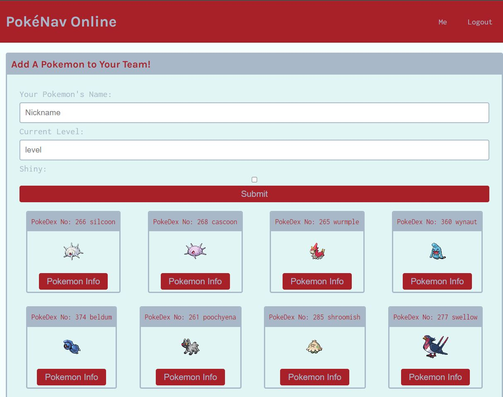

# PokéNav Online

Inspired by the recent new release of pokemon and my love for the overlooked 3rd generation, this application showcases a pokémon themed social media website. Users can create accounts, add friends and pokemon to their team, post thoughts and reactions, and manage their current team.

The application utilizes React, GraphQL, Apollo/Express, Bcrypt and JSON WEbtokens for Auth, MongoDB, and Node.js.

## Run Locally

Clone the project

```bash
  git clone https://github.com/SKYang014/poke-center
```

Go to the project directory

```bash
  cd poke-center
```

Install dependencies

```bash
  npm install
```

Start the server with concurrently

```bash
  npm run develop
```

## Demo

https://pokenav-online.onrender.com

## Screenshots

Homepage, not logged in:

Signup

Login

Home Page, logged in

Profile

Add Pokemon

My Profile

Pokemon Detail


## Acknowledgements

-   [Nick Markey - Wealth of help and knowledge](https://www.linkedin.com/in/nmarkey/)
-   [Awesome README](https://github.com/matiassingers/awesome-readme)

## 🚀 About Me

I'm a full stack developer located in the greater Sacramento area. When I'm not coding, I enjoy taking my cats out for a walk, crafting/sculpting, or planning my next project.
